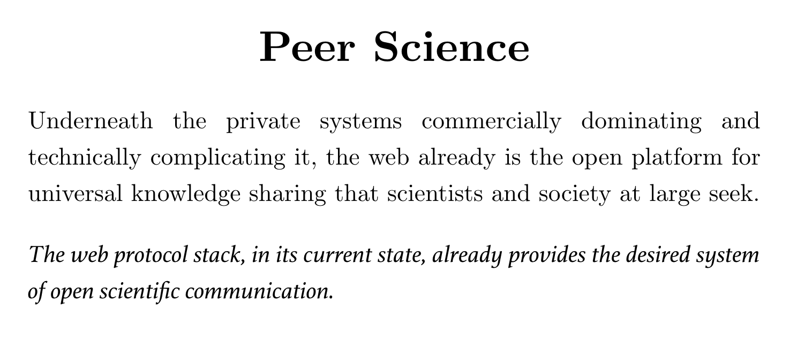
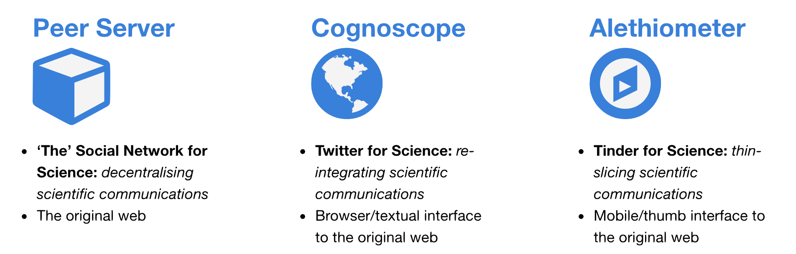

<strong style="font-size: 1.8em;">P2P Science</strong> is a set of four applications, currently in beta:

- **Peer Servers**
    + *decentralising scientific communications at the server*
    +  originally drawing on the work of p2p developers such as [Michiel de Jong](https://unhosted.org/manifesto.html) and [Dominic Tarr](https://scuttlebutt.nz/), then switching to Solid
- **Personal websites as queryable research data**
    + based on the work of [Ruben Verborgh](https://ruben.verborgh.org/), pre-Solid
- **Cognoscope** web app
    + *re-integrating scientific communications at the client* (RDF-based twitter for science)
- **Alethiometer** mobile web app
    + *thin-slicing scientific communications on mobile* (RDF-based Tinder for Science)

The organisation of the scientific enterprise is seizing up: competition for high-impact publication, problems with h-index and peer review, and rich-get-richer effects in distribution of funds, are combining with replication problems, administrative and PhD overproduction, corporatisation of the academy, and the rise of in-silico science.

#### References

- This work extends Stephen Friend et al.'s [Social Interactomes for Enabling Research Communities](https://cancerdiscovery.aacrjournals.org/content/4/11/1265), conducting several experiments between Helsinki, Stockholm, and Uppsala, in collaboration with [SciLifeLab](https://www.scilifelab.se/)
- This work extends foundational machine learning work done in Finland by the [Kohonen](https://en.wikipedia.org/wiki/Teuvo_Kohonen) lab and the [Centre for Consumer Society Research](https://www.helsinki.fi/en/researchgroups/centre-for-consumer-society-research) at UHel
- This work extends and is heavily inspired by the work of:
    +  [Ruben Verborgh](https://ruben.verborgh.org/) and colleagues (pre-Solid)
    +  P2P web teams: [Secure Scuttlebutt](https://scuttlebutt.nz/), [dat](https://dat.foundation/), [beaker](https://beakerbrowser.com/), & others 

- [1-page summary]()
- [Deck re. use of ML for research analytics]()

